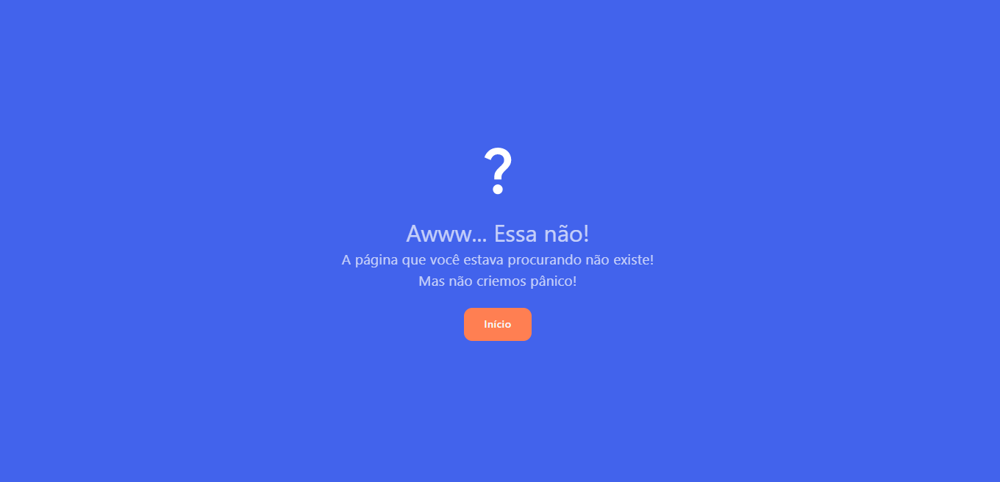
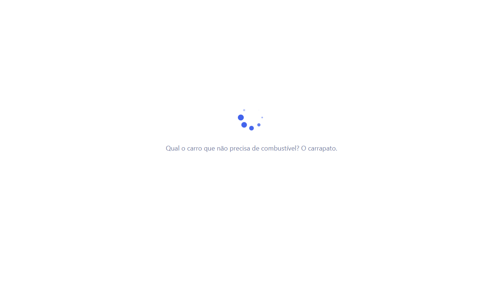
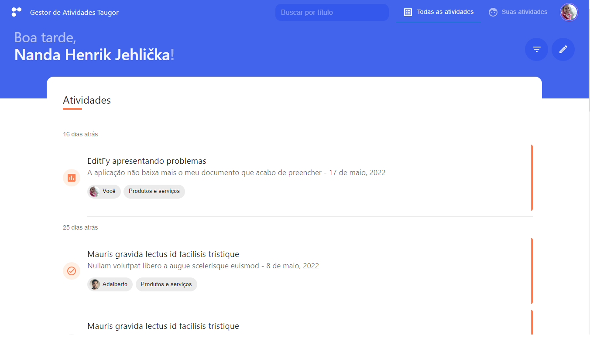

    
    <h2>Taugor Activity Management App</h2>

    A web application designed to control activities inside a corporation

    <i>Read this in other languages: <a href="README.md">English</a>, <a href="README.pt.md">Portuguese</a></i>

## Demo

Click [here](https://felipe1234-dev.github.io/taugor-app/#/login) for a functional demo.

<b>Email</b>: <i>user1@gmail.com</i>
<b>Password</b>: <i>123456</i>

## Website

### Login Page

### Error 404 Page

### Loading page

### Start page - All activities

### Mobile support

TaugorApp is compatible with devices of all sizes and operating systems, and consistent improvements are being made.

## Usage

### Desenvolvimento
Want to contribute? Great!

To fix a bug or improve an existing module, follow these steps:

- Fork the repository
- Create a new branch (`git checkout -b improve-feature`)
- Make appropriate changes to files
- Add changes to reflect changes made
- Commit your changes (`git commit -am 'Improve feature'`)
- Pull the branch (`git push origin improve-feature`)
- Create a pull request

### Features

* Search by: Title, Status, Priority, Tags.
* Search bar mimics MySQL's "LIKE" operator, however, in MongoDB (Firebase's official db).
* 30 by 30 infinite scrolling effect (same as Facebook and other social networks).
* Create and edit an activity with the following fields:
    * Title
    * Description (with rich text - WYSIWYG Editor)
    * Product
    * tags
    * Priority (High, Medium, Low)
    * One sentence problem (short description)
    * Attachments
* Document viewer

## Built with

- [React](https://pt-br.reactjs.org/) - A JavaScript library to create user interfaces created by Meta.
- [Typescript](https://www.typescriptlang.org/en/) - TypeScript is a strongly typed programming language that is based on JavaScript, offering better tools at any scale.
- [Firebase](https://firebase.google.com/) - Firebase is an app development platform that helps you build and develop apps and games that users love. Backed by Google and trusted by millions of businesses around the world.
- [SASS](https://sass-lang.com/) - Sass is the world's most mature, stable and powerful professional grade CSS extension language.

## To-do
- Document (attachment) library 

## Team

    <a href="https://github.com/felipe1234-dev">
         
         
        Felipe Alves
    </a>

## [License](LICENSE.md)

MIT © [Felipe Alves](https://github.com/felipe1234-dev)
