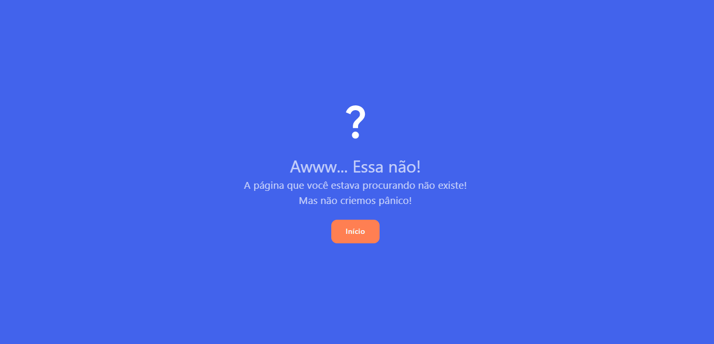
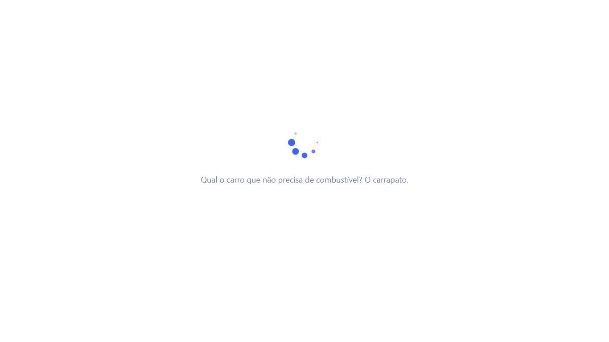
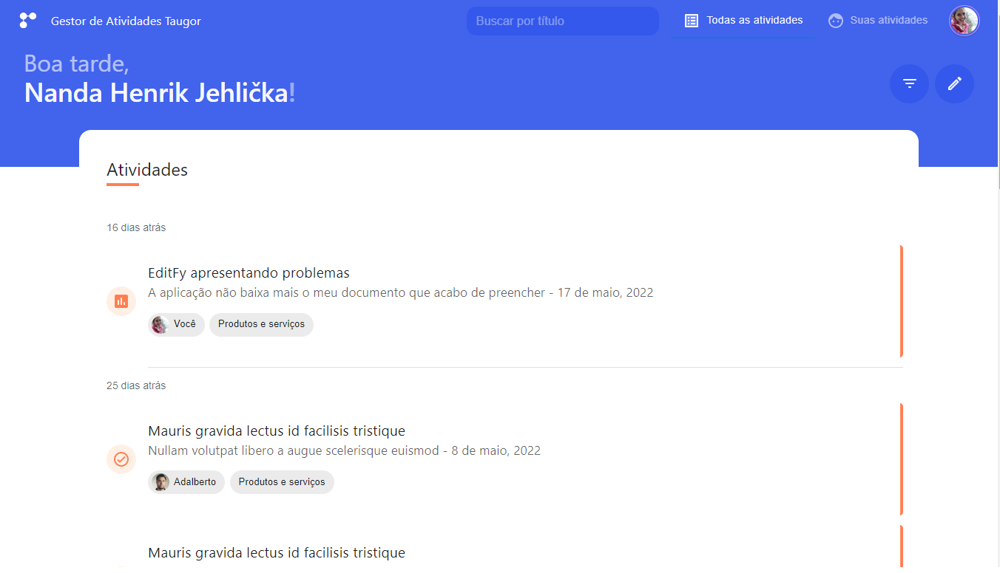

    
    <h2>App de Gestão de Atividades Taugor</h2>

    Uma aplicação WEB, desenhada para controlar atividades dentro da empresa

    <i>Leia isto em outros idiomas: <a href="README.md">English</a>, <a href="README.pt.md">Português</a></i>

## Demo
Clique [aqui](https://felipe1234-dev.github.io/taugor-app/#/login) para uma demo funcional.

<b>Email</b>: <i>user1@gmail.com</i>
<b>Senha</b>: <i>123456</i>

## Site

### Página de Login

### Página de Erro 404

### Transição de Páginas

### Página inicial - Todas as atividades

### Suporte para Mobile

O TaugorApp é compatível com dispositivos de todos os tamanhos e sistemas operacionais, e melhorias consistentes estão sendo feitas.

## Uso

### Desenvolvimento
Quer contribuir? Excelente!

Para corrigir um bug ou aprimorar um módulo existente, siga estas etapas:

- Faça um fork do repositório
- Crie um novo branch (`git checkout -b improve-feature`)
- Faça as alterações apropriadas nos arquivos
- Adicione alterações para refletir as alterações feitas
- Confirme suas alterações (`git commit -am 'Melhorar recurso'`)
- Faça um pull na branch (`git push origin improve-feature`)
- Criar uma pull request

### Funcionaliades

* Buscar por: Título, Status, Prioridade, Tags.
* Barra de pesquisa imita o operador "LIKE" do MySQL, porém, no MongoDB (bd oficial do Firebase).
* Efeito de rolagem infinita de 30 em 30 (igual ao Facebook e outras redes sociais).
* Criar e editar uma atividade com os seguintes campos: 
    * Título 
    * Descrição (com rich text - WYSIWYG Editor)
    * Produto 
    * Tags 
    * Prioridade (Alta, Média, Baixa) 
    * Problema em uma frase (descrição curta)
    * Anexos
* Visualizador de documentos

## Construído com

- [React](https://pt-br.reactjs.org/) - Uma biblioteca JavaScript para criar interfaces de usuário criada pela Meta.
- [Typescript](https://www.typescriptlang.org/pt/) - TypeScript é uma linguagem de programação fortemente tipada que se baseia em JavaScript, oferecendo melhores ferramentas em qualquer escala.
- [Firebase](https://firebase.google.com/) - O Firebase é uma plataforma de desenvolvimento de aplicativos que ajuda você a criar e desenvolver aplicativos e jogos que os usuários adoram. Apoiado pelo Google e confiável por milhões de empresas em todo o mundo.
- [SASS](https://sass-lang.com/) - Sass é a linguagem de extensão CSS de nível profissional mais madura, estável e poderosa do mundo.

## To-do
- Biblioteca de documentos (anexos)

## Equipe

    <a href="https://github.com/felipe1234-dev">
         
         
        Felipe Alves
    </a>

## [Licença](LICENSE.md)

MIT © [Felipe Alves](https://github.com/felipe1234-dev)